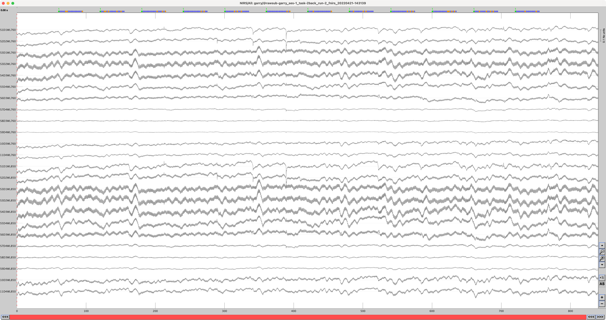

=========================
Add a raw fNIRS recording
=========================

- To add your raw fNIRS recording, right click on the subject you want to import a file for, and select "Review raw file".

- Make sure to select "NIRS: SNIRF (*.snirf)" in the 'File Format' dropdown menu, select the fNIRS recording file, and click 'Choose'.

- Always visually inspect the recording by double clicking on the "Link to raw file".

=====================
Convert event-markers
=====================

.. note::
   The event-markers that have been inserted in CortiView during the fNIRS recording are labeled 1, 2, 3, etc. and have a non-zero duration by default. The labels are not descriptive, and Brainstorm uses this duration to extract epochs i.e., Brainstorm does not allow us to specify our own duration. To resolve this, we need to relabel and convert the event-markers to from "extended" events to "simple" events. 

- Double click on the "Link to raw file".

- To relabel the event group, double click on the event and specify a new descriptive name.

- Select all the event groups in the "Events" panel.

.. figure:: images/01g_event-groups.png
  :width: 288px
  :align: center

- Select "Events" > "Convert to simple event", and select "Start".

.. figure:: images/01h_convert-to-simple-event.png
  :width: 252px
  :align: center

.. figure:: images/01i_select-start.png
  :width: 484px
  :align: center

- Close the opened windows and save modifications.