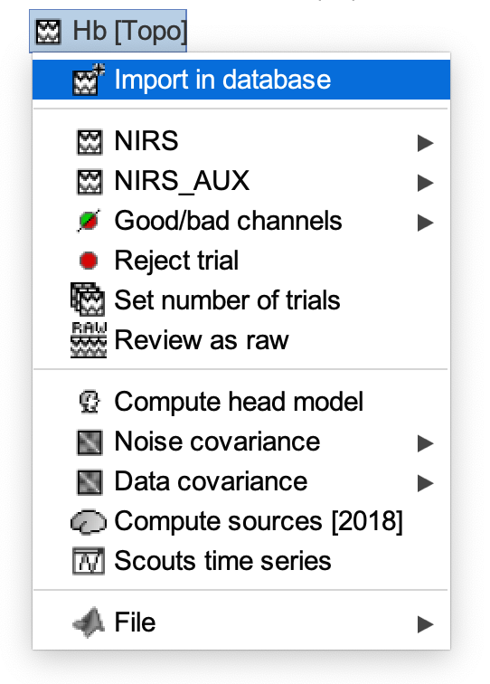
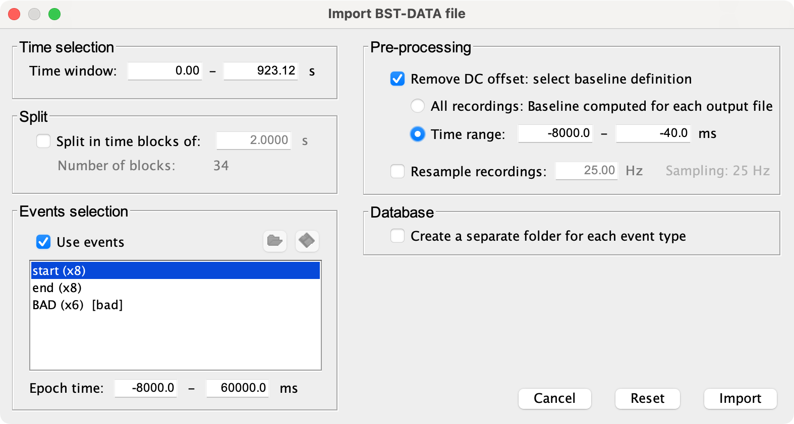

.. note::
   Read more about block average analysis on the `Brainstorm documentation website <https://neuroimage.usc.edu/brainstorm/Tutorials/NIRSFingerTapping#Window_averaging>`_. 

======================
Block average analysis
======================

Import into database
--------------------

- Right-click on the "Hb [Topo]" file and select "Import in database".

- Check the "Use events" box in the "Events selection" panel.
- Select the event of interest marking the start of the block.
- Specify your epoch time, e.g. -8000 to 42000 milliseconds.
- Check the "Remove DC offset" box in the "Pre-processing" panel.
- Specify the time range for the baseline, e.g. -8000 to -40 milliseconds.
- Click "Import".

Average across trials
---------------------

- Drag the new file(s), which are named after the event label you selected above, into the processes box.
- Click "Run".
- From the menu, select "Average" > "Average files".
- Select "By trial group (folder average)" in the group files radio-list.
- Select "Arithmetic average + Standard deviation" from the function radio-list.

**Now we're all set**

- Click "Run"
- Once the processes have completed, check the "Report" window for any further information, warnings and errors.
- Also, ALWAYS visually inspect the output files!