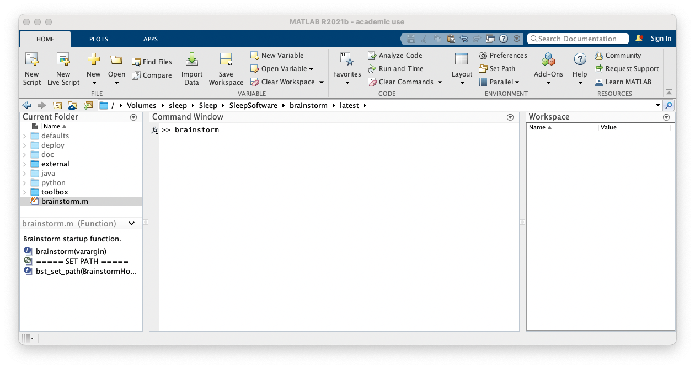
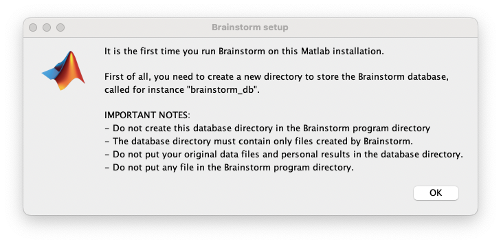

===============
Open Brainstorm
===============

- Start Matlab

- Navigate to the location where the file 'brainstorm.m' is.
- If you're on a shared computer, e.g. any of the Super Computers at the Woolcock Institute, type ``brainstorm reset`` and press enter.
- Type ``brainstorm`` and press enter.
- A 'License agreement' window will show, press 'I agree'.
- If this is the first time you've started Brainstorm, or if you had reset Brainstorm, a 'Brainstorm setup' window will show.

- Following the instructions in this window, you must create a new Brainstorm database directory, or select an existing one. Press 'OK'.
- In the Finder/File Explorer Window, select an empty directory (new) or your Brainstorm database directory (existing).

=====================
Create a new protocol
=====================

- If this is the first time that you've started Brainstorm, follow `these steps to create a new protocol <https://neuroimage.usc.edu/brainstorm/Tutorials/CreateProtocol>`_.
- Then `create a new subject <https://neuroimage.usc.edu/brainstorm/Tutorials/ImportAnatomy#Create_a_new_subject>`_.