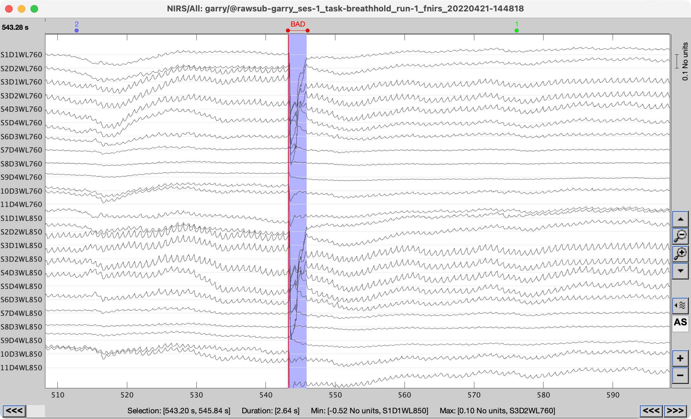
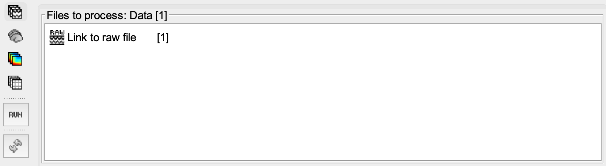

.. note::
   Read more about preprocessing of fNIRS data on the `Brainstorm documentation website <https://neuroimage.usc.edu/brainstorm/Tutorials/NIRSFingerTapping>`_. 

=================
Visual inspection
=================

- Open the fNIRS recording by double clicking on the "Link to raw file".
- Go through the entire dataset and manually mark any time-segment that contains artefact. To mark a time segment as bad, click-and-drag the mouse select an artefactual time window, and then press 'b' on the keyboard. This will create a "BAD" event.

- Close the data-inspection window, and save modifications.

================
Preproc pipeline
================

- Drag one or more "Link to raw file" into the "Files to process" box.

- Click "Run", the "Pipeline editor" will now open.

Detect bad channels
-------------------

- From the menu, select "NIRS" > "Pre-process" > "Detect bad channels".
- Check the box "Channel rejection by Scalp Coupling Index".
- Set the scalp coupling index (SCI) threshold to "80"%.
- Set the power threshold to "10"%.
- Uncheck all other boxes.
- Select "Keep all" in the auxillary measurement dropdown menu.

Convert to optical density
--------------------------

- From the menu, select "NIRS" > "dOD and MBLL" > "Raw to delta OD".
- Select "mean" in the "Baseline method" dropdown menu.
- Check the box "All file".

Bandpass filter
---------------

- From the menu, select "NIRS" > "Pre-process" > "Band-pass filter".
- Specify "NIRS" in the sensor types input field.
- Check the "Keep mean" box.
- Set the lower cutoff frequency to 0.005 Hz (or at least twice the period of your block + rest period).
- Set the upper cutoff frequency to 0.08 Hz (or maximum at 0.15 Hz, however please note that Mayer-waves occur roughly at 0.1 Hz)
- Set the filter order to "3".

Motion correction
-----------------

- From the menu, select "NIRS" > "Pre-process" > "Motion correction".
- Select "Spline correction" as the motion correction algorithm.
- Specify "BAD" as the movement event name.
- Set the smoothing parameters to "0.99".

Short-separation channel regression
-----------------------------------

- From the menu, select "NIRS" > "Pre-process" > "Remove superficial noise".
- Select "Based on Source-Detector distances" to select the short-separation channels.
- Set the separation threshold to "1.5" centimeters.

Convert to Hb concentrations
----------------------------

- From the menu, select "NIRS" > "dOD and MBLL" > "MBLL - delta OD to delta [HbO], [HbR] & [HbT]".
- Provided the age of the subject.
- Set the partial volume correction factor (PVF) to "50".
- Check the differential light path factor (DPF) correction box.
- Select "`DUNCAN1996 <https://pubmed.ncbi.nlm.nih.gov/8726247/>`_" or "`SCHOLKMANN2013 <https://pubmed.ncbi.nlm.nih.gov/24121731/>`_" as your correction method.

**Now we're all set**

- Click "Run"
- Once the processes have completed, check the "Report" window for any further information, warnings and errors.